# Recipe App

## Description
The Recipe App is a simple and interactive web application that allows users to search for recipes based on ingredients or dish names. This app pulls data from an external recipe API to display a list of recipes with relevant details, including ingredients, preparation time, and instructions. It's a handy tool for users who want to try new recipes or explore meal ideas based on available ingredients.

## Features
- **Search Recipes**: Look up recipes by ingredient or dish name.
- **Recipe Details**: View a detailed breakdown of ingredients, steps, and preparation time.
- **Favorite Recipes**: Save favorite recipes for easy access later.
- **Auto suggestion**

## How to Run the Application

1. **Clone the Repository**: Start by cloning the repository to your local machine:
   ```bash
   git clone https://github.com/kakhramanovruslan/midterm-project-front.git
2. *Open Recipe-App folder*
3. *Run index.html file*

## Screenshots
### Главный экран
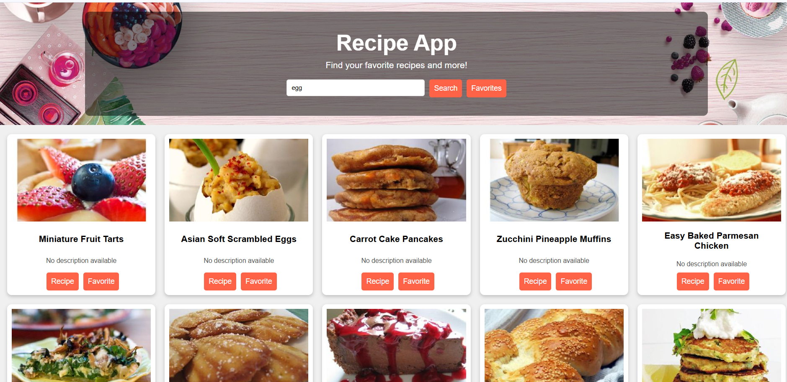

### Детальный рецепт
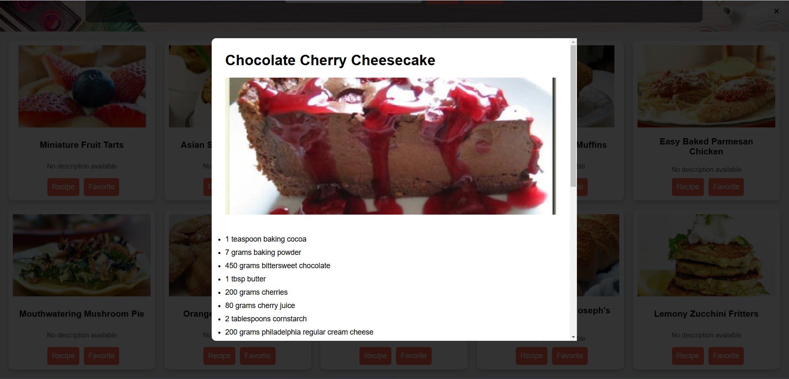

### Автозаполнение


### Адаптивный экран
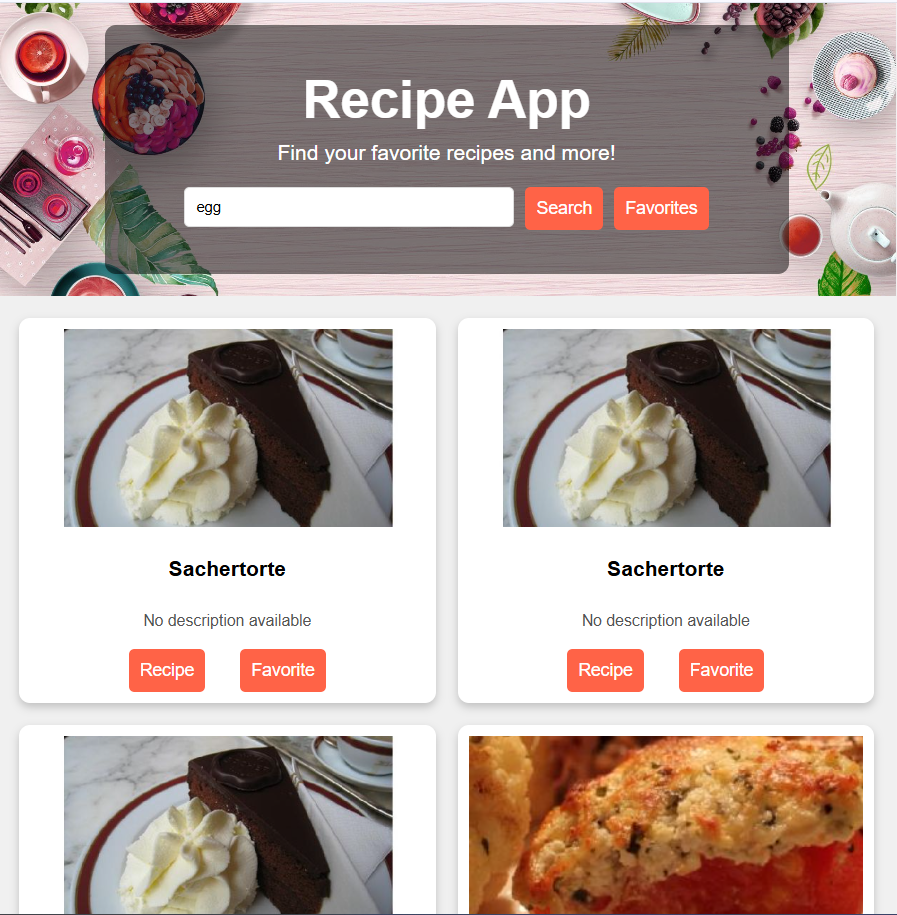


# Movies App

## Description
The Movies App is a web application that allows users to search for movie information, including descriptions, posters, ratings, and release dates. It provides a user-friendly interface to search for movies and view real-time details by connecting to a movie database.

## Features
- **Search Movies**: Allows users to find movies by title.
- **Movie Details**: Displays movie descriptions, genres, ratings, and other details.
- **Favorite Recipes**: Save favorite movies for easy access later.
- **Auto suggestion**

## How to Run the Application

1. **Clone the Repository**: Start by cloning the repository to your local machine:
   ```bash
   git clone https://github.com/kakhramanovruslan/midterm-project-front.git
2. *Open Movies-App folder*
3. *Run index.html file*

## Screenshots
### Главный экран
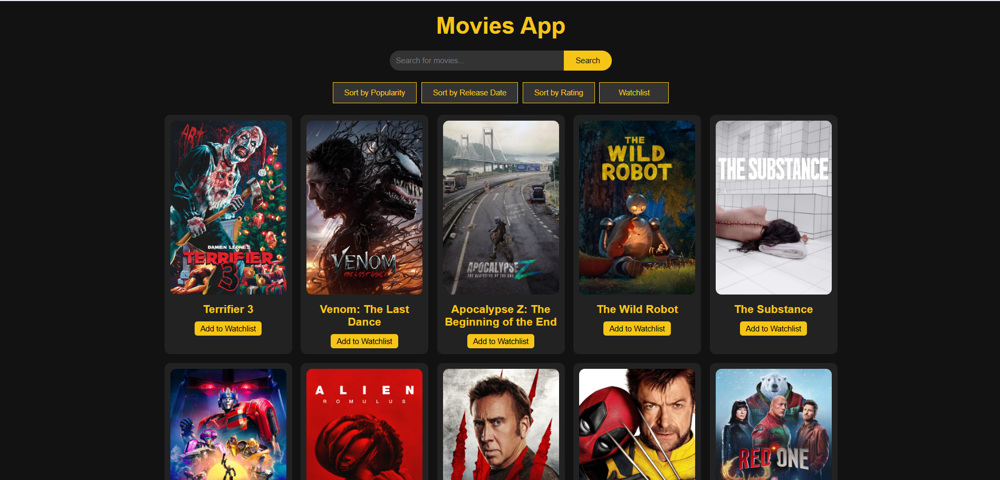

### Детальная информация о фильме
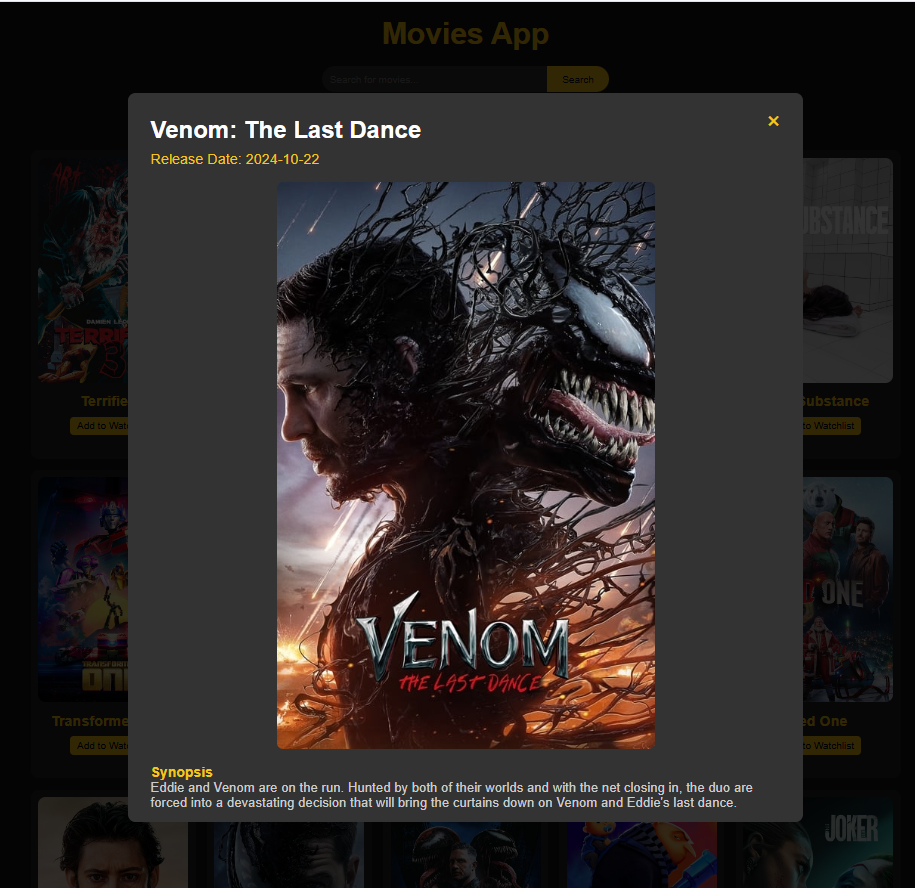
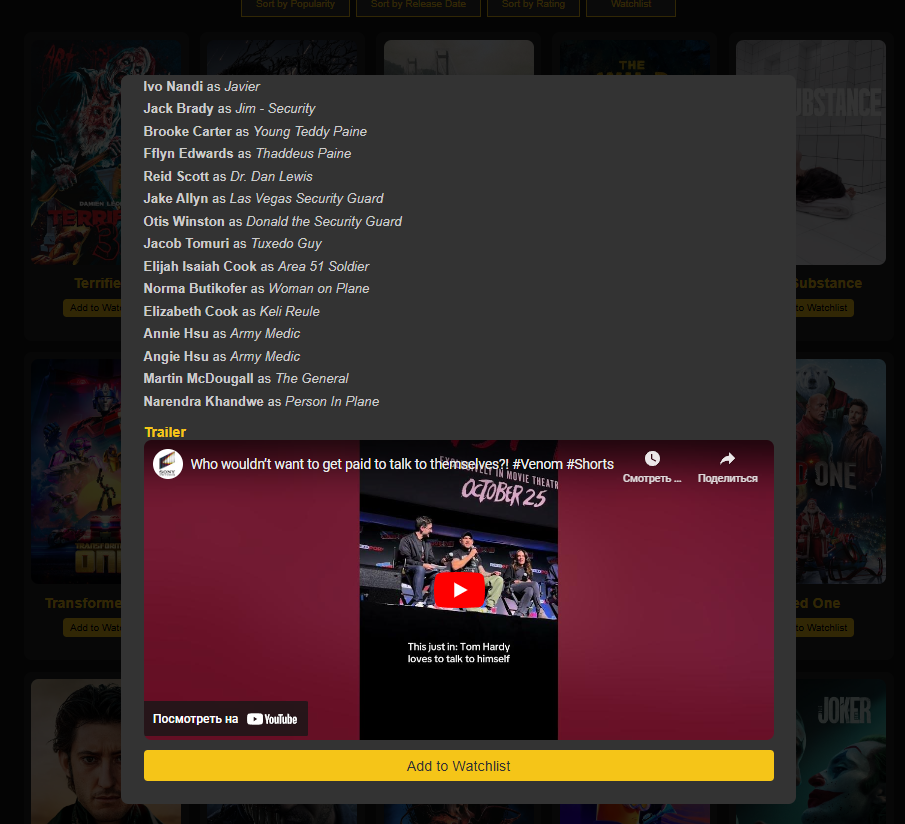

### Автозаполнение
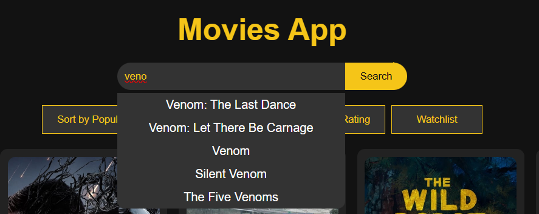

### Избранное
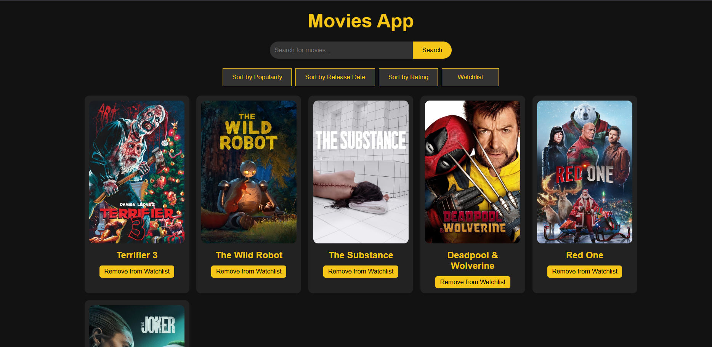

### Адаптивный экран
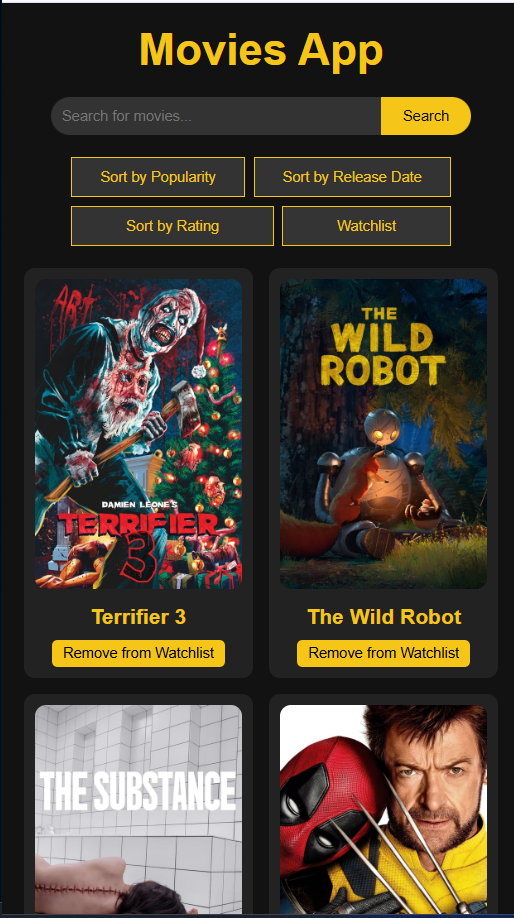


# Weather App

## Description
The Weather App is a web application that allows users to get current weather information and a 5-day forecast for a specified city. Users can also use their current location to get weather updates. The app provides temperature, humidity, wind speed, and weather conditions, with support for both Celsius and Fahrenheit.

## Features
- **City Search**: Find weather information by entering a city name.
- **Current Location**: Get weather data based on your current location.
- **5-Day Forecast**: Displays a 5-day weather forecast with daily highs, lows, and weather icons.
- **Celsius and Fahrenheit Toggle**: Choose between Celsius and Fahrenheit for temperature display.
- **Auto suggestion**

## How to Run the Application

1. **Clone the Repository**: Start by cloning the repository to your local machine:
   ```bash
   git clone https://github.com/kakhramanovruslan/midterm-project-front.git
2. *Open Weather-App folder*
3. *Run index.html file*

## Screenshots
### Главный экран
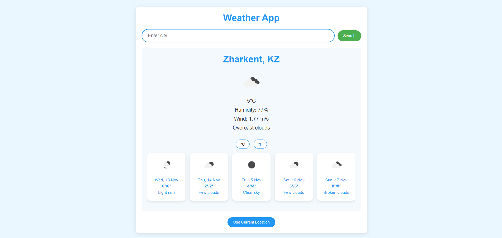

### Автозаполнение
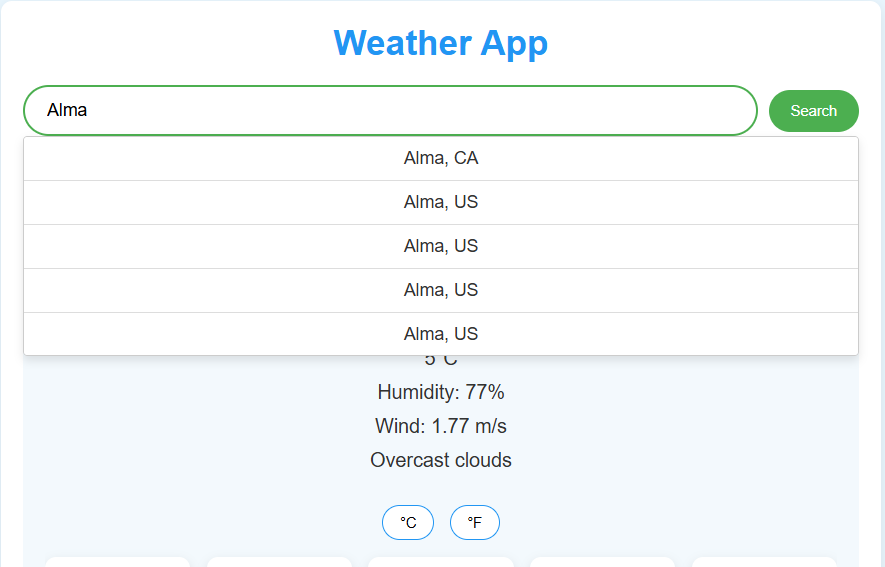

### Прогноз погоды
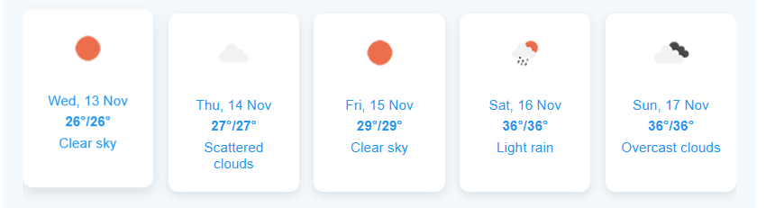

### Адаптивный экран
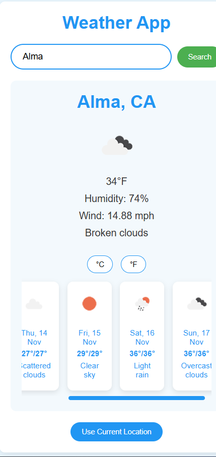


